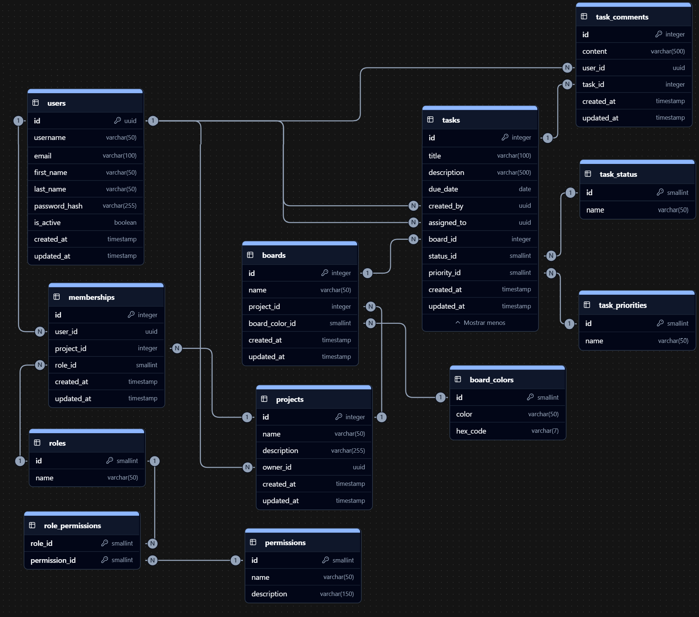

# Tesk

Software de gestión de equipos y tareas, basado en Jira/Asana/Monday.


## 📌 Descripción

Tesk es una aplicacion de gestión de proyectos construida con el stack PERN (PostgreSQL, Express.js, React, Node.js).

Se constituye separando por un lado el backend el cual consiste en una API REST basada en la `arquitectura en capas` (Layered Architecture) y el frontend que se componete de una `arquitectura basada en componentes`.

Dentro de varias características, podemos destacar la implementación de medidas de seguridad como la autenticación mediante JWT (tanto al momento de autenticar como en la sesión activa del usuario), la encriptación (hash) de contraseñas de los usuarios en la base de datos, validaciones de los datos recibidos a través de esquemas realizados con Zod y la verificación de permisos en cada solicitud realizada por un usuario gestionada a través de un middleware validador, entre otros.


## 🚀 Tecnologías utilizadas

**Servidor:** Node.js, Express.js, PostgreSQL, Sequelize, JSON Web Token (JWT), Bcryptjs, CookieParser, Zod, cors, dotenv, Morgan.

**Cliente:** React, React Router Dom, React Hook Form, Axios, date-fns, js-cookie, CSS.

## 🏰 Diagrama de la Base de Datos



## 📖 Lecciones aprendidas

Al realizar este proyecto aprendí a crear un sistema con una robustez superior a cualquier otro proyecto realizado antes, planificando de forma estratégica y anticipada el backend de tal forma que sea fácil y cómodo realizar modificaciones o implementaciones una vez comenzado a ser utilizado desde el frontend. Además de esto, también aprendí a utilizar un ORM para bases de datos relacionales tal como Sequelize.


## 🔗 Despliegue

[https://tesk-frontend.onrender.com/](https://tesk-frontend.onrender.com/)

## 📚 Correr la aplicación de forma local


1- Clonar el proyecto

```bash
  git clone https://github.com/alemontanez/tesk-pern
```

2- Ir al directorio del proyecto

```bash
  cd tesk-pern
```

3- Instalar dependencias

```bash
  npm install
```

4- Crear base de datos

5- Iniciar el servidor

```bash
  cd backend
```
```bash
  npm run dev
```

6- Ejecutar la siguiente consulta en la base de datos
```bash
INSERT INTO priorities (name)
VALUES 
	('Baja'),
	('Media'),
	('Alta'),
	('Máxima');

INSERT INTO roles (name, can_view, can_edit, can_manage, is_owner)
VALUES
	('viewer', true, false, false, false),
	('edit', true, true, false, false),
	('admin', true, true, true, false),
	('owner', true, true, true, true);

INSERT INTO labels (color, hex_code)
VALUES 
    ('blue', '#13488f');
```

7- Iniciar el cliente

```bash
  cd frontend
```
```bash
  npm run dev
```


## 🧭 Variables de entorno

Para ejecutar este proyecto, se necesita agregar las siguientes variables de entorno en un archivo .env dentro de la carpeta `backend`.

`PORT`
`DB_USER`
`DB_NAME`
`DB_PASSWORD`
`TOKEN_SECRET`
`FRONTEND_URL`

